#  DeskHop - Fast Desktop Switching

Did you ever notice how, in the crazy world of tech, there's always that one quirky little project trying to solve a problem so niche that its only competitors might be a left-handed screwdriver and a self-hiding alarm clock?

I use two different computers in my daily workflow and share a single keyboard/mouse pair between them. Trying several USB switching boxes found on Amazon made me realize they all suffer from similar issues - it takes a while to switch, the process is quite clumsy when trying to find the button and frankly, it just doesn't get any better with time. 

All I wanted was a way to use a keyboard shortcut to quickly switch outputs, paired with the ability to do the same by magically moving the mouse pointer between monitors. This project enables you to do both, even if your computers run different operating systems!

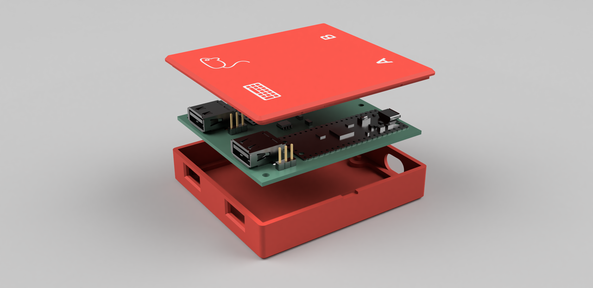

## Features

- Completely **[free and open source](https://certification.oshwa.org/de000149.html)**
- No noticeable delay when switching
- Simply drag the mouse pointer between computers
- No software installed
- Affordable and obtainable components (<15€)
- 3D printable snap-fit case
- Full Galvanic isolation between your outputs
- Works with Linux, macOS and Windows

[User Manual](user-manual.pdf) is now available


------

## How it works

The device acts as an intermediary between your keyboard/mouse and the computer, establishing and maintaining connections with both computers at once. Then it chooses where to forward your mouse and keystrokes to, depending on your selection. Keyboard follows the mouse and vice versa, so just dragging the mouse to the other desktop will switch both.

## Mouse 

To get the mouse cursor to magically jump across, the mouse hid report descriptor was changed to use absolute coordinates and then the mouse reports (that still come in relative movements) accumulate internally, keeping the accurate tally on the position. 

When you try to leave the monitor area in the direction of the other monitor, it keeps the Y coordinate and swaps the maximum X for a minimum X, then flips the outputs. This ensures that the cursor seamlessly appears at the same height on the other monitor, enhancing the perception of a smooth transition.

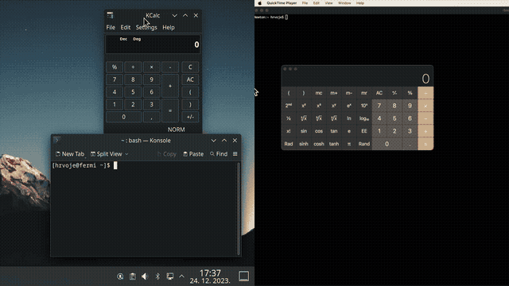

 <p align="center"> Dragging the mouse from Mac to Linux automatically switches outputs. 
 </p>

-----
 
The actual switch happens at the very moment when one arrow stops moving and the other one starts.

## Keyboard

Acting as a USB Host and querying your keyboard periodically, it looks for a preconfigured hotkey in the hid report (usually Ctrl + Caps Lock for me). When found, it will forward all subsequent characters to the other output.

To have a visual indication which output you are using at any given moment, you can repurpose keyboard LEDs and have them provide the necessary feedback. 

It also remembers the LED state for each computer, so you can pick up exactly how you left it. 

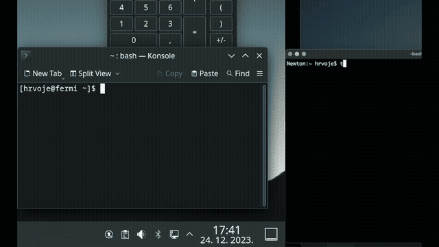

## How to build

To avoid version mismatch and reported path issues when building, as well as to save you from having to download a large SDK, the project now bundles minimal pico sdk and tinyusb.

On a Debian/Ubuntu systems, make sure to install these:

```
sudo apt install cmake gcc-arm-none-eabi libnewlib-arm-none-eabi build-essential
```

You should be able to build by running:

```
cmake -S . -B build
cmake --build build
```

additionally, to rebuild web UI check webconfig/ and execute ```./render.py```, you'll need jinja2 installed.

To rebuild the disk, check disk/ folder and run ```./create.sh```, tweak to your system if needed. You'll need **dosfstools** (to provide mkdosfs),   

## Using a pre-built image

Alternatively, you can use the [pre-built images](https://github.com/hrvach/deskhop/releases). Since version 0.6 there is only a single universal image. You need the .uf2 file which you simply copy to the device in one of the following ways:

## Upgrading firmware

**Option 1** - (firmware 0.6 and later) Put the device in "config mode" by simultaneously pressing **left ctrl + right shift + c + o**. Device your keyboard is plugged into will reboot and turn into a USB drive called "DESKHOP". All you need to do is copy the .uf2 file to it. Once image is verified, device will flash and reboot, then proceed to upgrade the other board. During this operation the led will blink. Once it's done, it will write flash and reboot, completing the operation.

_Note_ - This is not an actual generic USB drive, you can't use it to copy files to it.

**Option 2** - Using the ROM bootloader - hold the on-board button while connecting each Pico and copy the uf2 to the flash drive that appears. Images later than 0.6 support holding the button without having to fiddle around the power supply, but the "hold button while plugging" should always work, regardless of device state.

## Misc features

### Mouse slowdown

Ever tried to move that YT video slider to a specific position but your mouse moves too jumpy and suddenly you are moving your hand super-carefully like you're 5 and playing "Operation" all over again?

**Press right CTRL + right ALT** to toggle a slow-mouse mode. The mouse pointer will slow down considerably, enabling you to get the finer precision work done and still have your mouse moving normally by quickly pressing the same keys again.

### Switch Lock

If you want to lock yourself to one screen, use ```RIGHT CTRL + K```.
This will make sure you won't accidentally leave your current screen. To turn off, press the same key combo again.

### Lock Both Screens

You can lock both computers at once by using ```RIGHT CTRL + L```. 
To make use of this feature, first set up the OS for each output in config (since the shortcuts are different).

### Gaming Mode

If you're gaming, there is a chance your game might not work properly with absolute mouse mode. To address that issue, a **gaming mode** is introduced, toggled by ```LEFT CTRL + RIGHT SHIFT + G```. When in gaming mode, you are locked to the current screen and your mouse behaves like a standard relative mouse. This should also fix various virtual machine issues, currently unsupported operating systems etc.

### Screensaver

Supposedly built in to prevent computer from entering standby, but truth be told - it is just fun to watch. **Off by default**, will make your mouse pointer bounce around the screen like a Pong ball. When enabled, it activates after a period of inactivity defined in user config header and automatically switches off as soon as you send any output towards that screen. 

Potential usage example - I have a buggy USB dock that won't resume video from standby, so not allowing it to sleep can be a handy workaround. 

## Hardware

[The circuit](schematics/DeskHop_v1.1.pdf) is based on two Raspberry Pi Pico boards, chosen because they are cheap (4.10 € / pc), can be hand soldered and most suppliers have them in stock.

The Picos are connected using UART and separated by an Analog Devices ADuM1201 dual-channel digital isolator (~3€) or a much cheaper, faster and pin-compatible TI ISO7721DR (~1.5€) which is the preferred choice. 

While they normally don't have support for dual USB, thanks to an [amazing project](https://github.com/sekigon-gonnoc/Pico-PIO-USB) where USB is implemented using the programmable IO wizardry found in RP2040, there is support for it to act both as an USB host and device.  

## PCB [updated]

To keep things as simple as possible for DIY builds, the traces were kept on one side and the number of parts kept to a minimum.

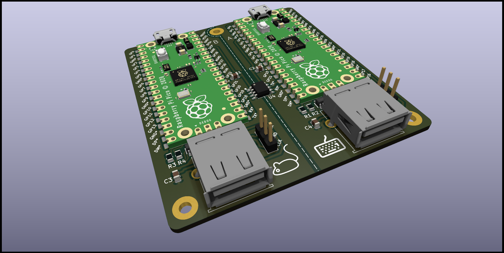

USB D+/D- differential lines should be identical in length, but they are slightly asymmetrical on purpose to counter the length difference on the corresponding GPIO traces PICO PCB itself, so the overall lengths should match.

Zd (differential impedance) is aimed as 90 ohm (managed to get ~107, close enough :)).

The thickness is designed to be 1.6 mm for snap-fit to work as expected.

There are 2 versions of the PCB (no major differences for the user). Original (v1.0) is easier to solder and assemble, while v1.1 offers some upgrades like:
 - added ESD protection (TPD4E1U06DBVR)
 - added VBUS capacitor for the keyboard/mouse connectors
 - silkscreen orientation markings
 - holes for clone boards with headers pre-soldered and easier alignment
 - USB 27 ohm resistors
 
  This version is slightly more difficult to hand solder due to the small transient voltage suppressor IC and 0805 resistors, but it's totally doable. TVS can in theory be omitted (not advised) and it will still work.

Upcoming - board with bare rp2040s that doesn't need Picos, is smaller and more convenient.

## Case

Since I'm not very good with 3d, the case is [simple and basic](case/) but does the job. It should be easy to print, uses ~33g of filament and takes a couple of hours.

Horizontal PCB movements are countered by pegs sliding through holes and vertical movements by snap-fit lugs on the sides - no screws required. The case was given a slight redesign to feature the logo and two additional snap-fit lugs, so it provides a better seal.

Micro USB connectors on both boards are offset from the side of the case, so slightly larger holes should allow for cables to reach in. 

The lid is of a snap-fit design, with a screwdriver slot for opening. The markings on top are recessed and can be finished with e.g. crayons to give better contrast (or simply left as-is).

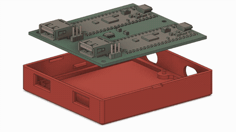

## Bill of materials 

<details closed>
  <summary>Click here to view original PCB v1.0 BOM</summary>

| Component          | Qty | Unit Price / € | Price / €|
|--------------------|-----|----------------|----------|
| Raspberry Pi Pico  | 2   | 4.10           | 8.20     |
| ADuM1201BRZ        | 1   | 2.59           | 2.59     |
| Cap 1206 SMD 100nF | 2   | 0.09           | 0.18     |
| USB-A PCB conn.    | 2   | 0.20           | 0.40     |
| Headers 2.54 1x03  | 2   | 0.08           | 0.16     |
|                    |     |                |          |
|                    |     |          Total | 11.53    |

TI ISO7721DR can be used instead of the ADuM - it's pin-compatible, much cheaper and with better specs.

</details>

#### PCB v1.1

| Component      | Part                | Qty | Unit Price / € | Price / €|
|----------------|---------------------|-----|----------------|----------|
|     U1, U2     | Raspberry Pi Pico   | 2   | 4.10           | 8.20     |
|     J1, J4     | USB-A PCB conn.     | 2   | 0.20           | 0.40     |
|       U4       | TI ISO7721DR        | 1   | 1.40           | 1.40     |
|                | (**OR** ADuM1201BRZ)|     |                |          |
|     C1, C2     | Cap 0805 SMD 100nF  | 2   | 0.09           | 0.18     |
| R1, R2, R3, R4 | Res 0805 SMD 27ohm  | 4   | 0.03           | 0.12     |
|     U3, U5     | TPD4E1U06DBVR       | 2   | 0.31           | 0.62     |
|     C3, C4     | Cap 4.7uF SMD 0805  | 2   | 0.07           | 0.14     |
|     J2, J3     | Headers 2.54 1x03   | 2   | 0.08           | 0.16     |
|                |                     |     |                |          |
|                |                     |     |          Total | 11.22    |

USB-A connector can be Molex MX-67643-0910 or a cheaper/budget one that shares the same dimensions.

Additional steps:

 - making the PCB ([Gerber provided](pcb/), choose 1.6 mm thickness)
 - 3d printing the case ([stl files provided](case/), ~33g filament)

## Assembly guide

If you have some experience with electronics, you don't need this. However, some of you might not, and in that case this video might help guide you through the process. Please note, after soldering you should clean the flux from the PCB to prevent corrosion. 

The standard process to do that is using isopropyl alcohol and an old toothbrush. But guess what? I'm not putting my old toothbrush online, so you'll just have to improvise that part :)

[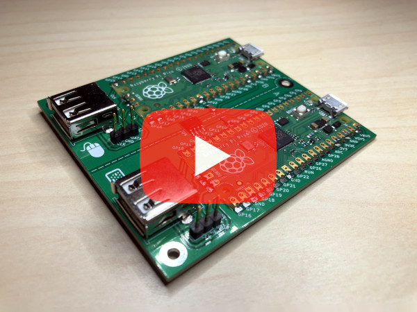](https://www.youtube.com/watch?v=LxI9NYi_oOU)

[NOTE] The video assembly guide covers pcb v1.0. The revised version is very similar and the procedure is basically the same. 

## Usage guide

### Keyboard shortcuts - (fw versions 0.68+)

_Config_
- ~~```Left Shift```~~ ```Left Ctrl + Right Shift + C + O``` - enter config mode
- ```Right Shift + F12 + D``` - remove flash config
- ```Right Shift + F12 + Y``` - save screen switch offset

_Usage_
- ```Right CTRL + Right ALT``` - Toggle slower mouse mode
- ```Right CTRL + K``` - Lock/Unlock mouse desktop switching
- ```Right CTRL + L``` - Lock both outputs at once (set output OS before, see shortcuts below)
- ~~```Left Shift```~~ ```Left CTRL + Right Shift + G``` - Toggle gaming mode (lock to screen, act as standard mouse)
- ```Left CTRL + Right Shift + S``` - Enable screensaver
- ```Left CTRL + Right Shift + X``` - Disable screensaver
- ```Left CTRL + Caps Lock``` - Switch between outputs

Note: some keyboards don't send both shifts at the same time properly, that's why the shortcut was changed - to work for everyone. Apologies for the confusion.

### Switch cursor height calibration

This step is not required, but it can be handy if your screens are not perfectly aligned or differ in size. The objective is to have the mouse pointer come out at exactly the same height.

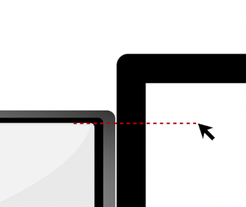

Just park your mouse on the LARGER screen at the height of the smaller/lower screen (illustrated) and press ```Right Shift + F12 + Y```. Your LED (and caps lock) should flash in confirmation.

Repeat for the bottom border (if it's above the larger screen's border). This will get saved to flash and it should keep this calibration value from now on.

### Multiple screens per output

Windows and Mac have issues with multiple screens and absolute positioning, so workarounds are needed (still experimental). There is a better workaround under construction, but for now you have to set the operating system for each output and number of screens.

Your main screens need to be in the middle, and secondary screen(s) on the edges. To configure the actual options, open the web configuration page for your device.

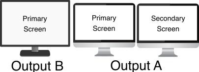

### Web configuration mode

Starting with fw 0.6, an improved configuration mode is introduced. To configure your device, follow these instructions:

1. Press Left Ctrl + Right Shift + C + O - your device will reboot and enter configuration mode (on the side your keyboard is plugged into). LED will keep blinking during the configuration session.
2. A new USB drive will appear named "DESKHOP" with a single file, config.htm
3. Open that file with Chromium / Chrome. Unfortunately FF is not supported right now, since they avoid implementing WebHID.
4. Click connect and allow deskhop device to pair.

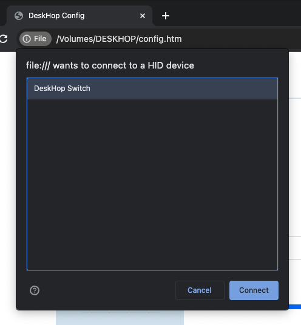

5. Configure the options as you wish and click save to write to device.
6. Click "exit" in the menu to leave configuration mode for added safety.

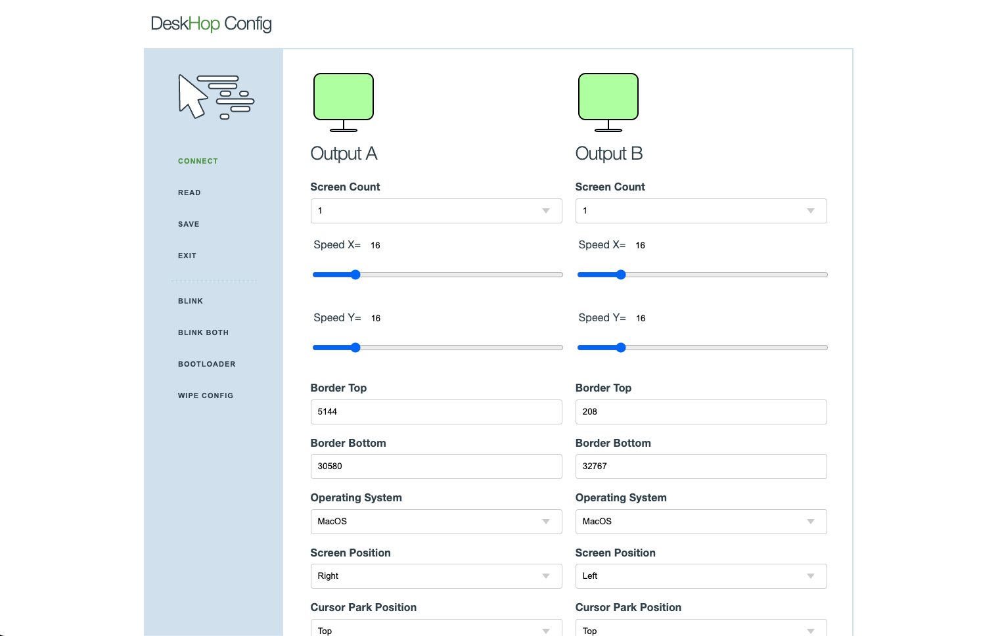

Q: Why not simply create a nice online web page like Via instead of dealing with this weird USB drive thing? 
A: Loading javascript from a random online location that interacts with your input devices is a potential security risk. The configuration web page is local only and nothing is ever loaded externally.

<details closed>
  <summary>Linux doesn't see device? Click here.</summary>

Q: Chromium on Linux doesn't work. 
A: You probably need to tweak /dev permissions or create a corresponding udev rules file and make sure your user is in the right group, like so:

/etc/udev/rules.d/99-deskhop.rules
```
KERNEL=="hidraw*", SUBSYSTEM=="hidraw", ATTRS{idVendor}=="1209", ATTRS{idProduct}=="c000", GROUP="plugdev", MODE="0660" 
```
</details><br />

Please note the config web page is not "weird" because of deliberate obfuscation - it's self-decompressing due to very limited storage. Entire source is 100% open and a part of this repo. You are encouraged to rebuild everything yourself.

### Functional verification

When you connect a new USB peripheral, the board will flash the led twice, and instruct the other board to do the same. This way you can test if USB and outgoing communication works for each board.

Do this test by first plugging the keyboard on one side and then on the other. If everything is OK, leds will flash quickly back and forth in both cases.

## Security and Safety

Some features are missing on purpose, despite the fact it would make the device easier to use or simpler to configure. Here is a quick breakdown of these decisions:

- There is no copy-paste or *any* information sharing between systems. This prevents information leakage.
- No webhid device management without explicit user consent. No inbound connectivity from the output computers, with the only exception of standard keyboard LED on/off messages and hard limited to 1 byte of data.
- No FW upgrade triggering from the outputs. Only explicit and deliberate user action through a special keyboard shortcut may do that.
- No plugged-in keyboard/mouse custom endpoints are exposed or information forwarded towards these devices. Their potential vulnerabilities are effectively firewalled from the computer.
- No input history is allowed to be retained.
- No device-initiated keystrokes, for any reason. Only thing that comes out is what you type/trigger.
- Outputs are physically separated and galvanically isolated with a minimal isolation voltage of 2kV.
- All packets exchanged between devices are of fixed length, config options transferred are limited to a short list. Most options are read-only. Cross-device firmware upgrades can be disabled.
- There is no bluetooth or wifi, networking, Internet access, etc.
- No connected computer is considered trusted under any circumstances.
- Configuration mode is automatically disabled after a period of inactivity.
- Entirety of the code is open source, without any binary blobs and thoroughly commented to explain its purpose. I encourage you to never trust anyone and always make sure you know what you are running by doing a manual audit.

This still doesn't guarantee anything, but I believe it makes a reasonable set of ground rules to keep you safe and protected.

## FAQ

1. I just have two Picos, can I do without a PCB and isolator?

*Sure. Having an isolator is recommended but it should work without it.*

2. What happens if I have two different resolutions on my monitors?

*The mouse movement is done in abstract coordinate space and your computer figures out how that corresponds with the physical screen, so it should just work.*

3. Where can I buy it?

*I'm not selling anything, this is just a personal, non-commercial hobby project.*

[UPDATE] It seems you can order it in QTY of 1 (for either PCB, assembled PCB or a fully assembled device) from [Elecrow if you follow this link](https://www.elecrow.com/deskhop-fast-desktop-switching.html)
As reported by users, your **board will arrive blank** and you have to write the firmware yourself.

[UPDATE2] - I never asked Elecrow for anything, but a couple of days ago they offered to sponsor the project with a small budget that will be used for future board prototyping. Since my goal is to create a better board with more than 2 outputs etc, I believe prototyping services might be beneficial to the project.

4. When the active screen is changed via the mouse, does the keyboard follow (and vice versa)?

*Yes, the idea was to make it behave like it was one single computer.*

5. Will this work with keyboard/mouse combo dongles, like the Logitech Unifying receiver?

It should work. After a recent FW update, support for combo receivers should be much better.

6. Will this work with wireless mice and keyboards that have separate wireless receivers (one for the mouse, another for the keyboard)?

*It should work - tried an Anker wireless mouse with a separate receiver and that worked just fine.*

7. I have issues with build or compilation

*Check out the [Troubleshooting Wiki](https://github.com/hrvach/deskhop/wiki/Troubleshooting) that might have some answers.*

## Software Alternatives

There are several software alternatives you can use if that works in your particular situation.

1. [Barrier](https://github.com/debauchee/barrier) - Free, Open Source
2. [Input Leap](https://github.com/input-leap/input-leap) - Free, Open Source
3. [Synergy](https://symless.com/synergy) - Commercial
4. [Mouse Without Borders](https://www.microsoft.com/en-us/garage/wall-of-fame/mouse-without-borders/) - Free, Windows only
5. [Universal Control](https://support.apple.com/en-my/HT212757) - Free, Apple thing

## Shortcomings

- Windows 10 broke HID absolute coordinates behavior in KB5003637, so you can't use more than 1 screen on Windows (mouse will stay on the main screen). There is an experimental workaround with a better one on the way.
- Code needs cleanup, some refactoring etc.
- Not tested with a wide variety of devices, I don't know how it will work with your hardware. There is a reasonable chance things might not work out-of-the-box. 
- Advanced keyboards (with knobs, extra buttons or sliders) will probably face issues where this additional hardware doesn't work.
- Super-modern mice with 300 buttons might see some buttons not work as expected.
- NOTE: **Both computers need to be connected and provide power to the USB for this to work** (as each board gets powered by the computer it plugs into). Many desktops and laptops will provide power even when shut down nowadays. If you need to run with one board fully disconnected, you should be able to use a USB hub to plug both keyboard and mouse to a single port.
- MacOS has issues with more than one screens, latest firmware offers an experimental workaround that fixes it.

## Progress

So, what's the deal with all the enthusiasm? I can't believe it - please allow me to thank you all! I've never expected this kind of interest in a simple personal project, so the initial features are pretty basic (just like my cooking skills) and mostly cover my own usecase. Stay tuned for firmware updates that should bring wider device compatibility, more features and less bugs. As this is a hobby project, I appreciate your understanding for being time-constrained and promise to do the best I can.

Planned features:
- Better workarounds for multiscreen windows and macos
- Transparent / Gaming mode
- Support for more than 2 outputs
- Improvements on the configuration UI
- ... and more!

Working on a *lite* version which provides basic functionality with just a single Pico W board, lowering the cost even further and enabling you to try it out even with no added hardware or PCB.

Mouse polling should now work at 1000 Hz (the dips in the graph is my arm hurting from all the movement :-)):

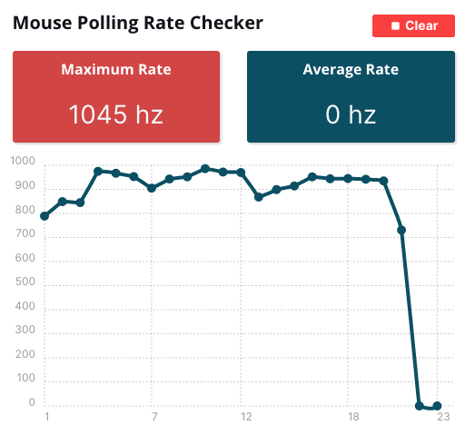

## Sponsor / donate

I'm NOT doing this for profit or any other reason except to try and help people by creating a better working environment for everyone.
If you want to support the project further, please consider making a small donation towards a charity like **Doctors Without Borders**.

[](https://donate.doctorswithoutborders.org/secure/donate)

Please allow me to thank everyone who helped or considering it!

## Disclaimer

I kindly request that anyone attempting to build this project understands and acknowledges that I am not liable for any injuries, damages, or other consequences. Your safety is important, and I encourage you to approach this project carefully, taking necessary precautions and assuming personal responsibility for your well-being throughout the process. Please don't get electrocuted, burned, stressed or angry. Have fun and enjoy! 

Happy switchin'!
